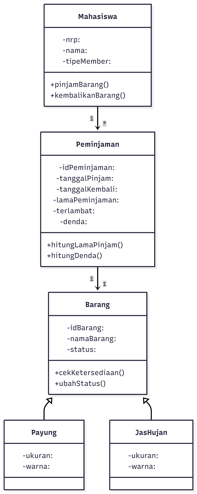

# Sistem Peminjaman Payung dan Jas Hujan di Kampus

## Deskripsi Kasus
Project ini berupa sistem peminjaman payung dan jas hujan di kampus. Saat hujan, mahasiswa dapat meminjam perlengkapan hujan. Program ini memiliki data peminjam, jenis barang yang dipinjam, lama peminjaman, keterlambatan, serta denda yang harus dibayar. Untuk sistemnya, terdapat dua jenis member, yaitu member biasa dan member prioritas, yang memiliki perbedaan pada biaya denda.

## Class Diagram

## Kode Program Java
Project ini terdiri dari file:
- Main.java
- Peminjam.java
- MemberBiasa.java
- MemberPrioritas.java
- ItemPinjaman.java
- Payung.java
- JasHujan.java
- Peminjaman.java

## Screenshot Output

## Prinsip OOP yang Diterapkan

### 1. Class dan Object
Program dibuat dari beberapa class seperti `Peminjam`, `ItemPinjaman`, `Payung`, `JasHujan`, dan `Peminjaman`. Dari class tersebut dibuat object didalam `Main.java`.

### 2. Encapsulation
Data pada class disimpan dalam atribut `private`, seperti nama, NRP, kode item, dan status ketersediaan, dan diakses melalui melalui getter dan setter.

### 3. Inheritance
Class `MemberBiasa` dan `MemberPrioritas` adalah lanjutan dari class `Peminjam`.  
Class `Payung` dan `JasHujan` juga lanjutan dari class `ItemPinjaman`.

### 4. Polymorphism
Method `getTipeMember()`, `hitungDiskonDenda()`, `hitungDendaPerHari()`, dan `getJenis()` memiliki penerapan yabg berbeda pada masing-masing subclass.

### 5. Abstraction
Class `Peminjam` dan `ItemPinjaman` dibuat sebagai abstract class karena menjadi utama untuk class berikutnya.

## Keunikan Program
Keunikan program ini adalah mengambil jasa peminjaman payung dan jas hujan di kampus, yang ada di kehidupan sehari-hari mahasiswa tetapi jarang ada. Program ini juga memiliki dua jenis member dan jenis barang, sehingga lebih menarik dibanding program lainnya.
