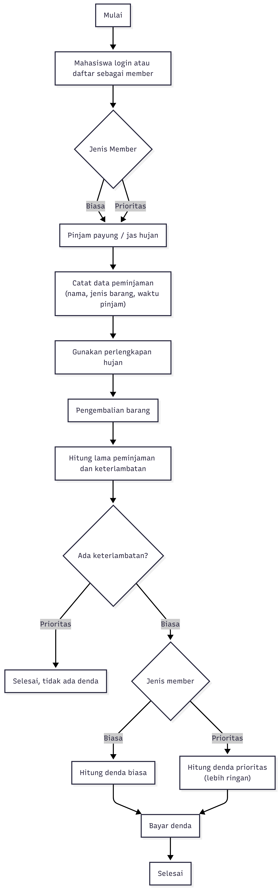
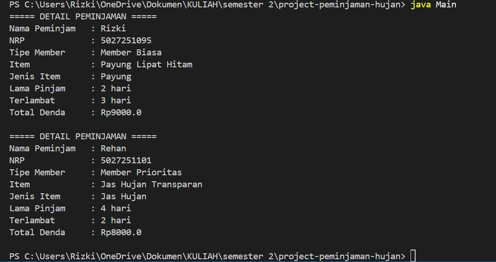

# Sistem Peminjaman Payung dan Jas Hujan di Kampus

## Deskripsi Kasus
Program ini dibuat untuk mensimulasikan sistem peminjaman payung dan jas hujan di kampus. Saat hujan turun secara tiba-tiba, mahasiswa dapat meminjam perlengkapan hujan yang tersedia. Program ini mencatat data peminjam, jenis barang yang dipinjam, lama peminjaman, keterlambatan, serta denda yang harus dibayar. Selain itu, terdapat dua jenis member, yaitu member biasa dan member prioritas, yang memiliki perbedaan pada perhitungan denda.

## Class Diagram
```md
## Class Diagram

```
## Kode Program Java
Project ini terdiri dari file:
- Main.java
- Peminjam.java
- MemberBiasa.java
- MemberPrioritas.java
- ItemPinjaman.java
- Payung.java
- JasHujan.java
- Peminjaman.java

## Screenshot Output


## Prinsip OOP yang Diterapkan

### 1. Class dan Object
Program dibangun dari beberapa class seperti `Peminjam`, `ItemPinjaman`, `Payung`, `JasHujan`, dan `Peminjaman`. Dari class tersebut dibuat object di dalam `Main.java`.

### 2. Encapsulation
Data pada class disimpan dalam atribut `private`, seperti nama, NRP, kode item, dan status ketersediaan. Akses dilakukan melalui getter dan setter.

### 3. Inheritance
Class `MemberBiasa` dan `MemberPrioritas` mewarisi class `Peminjam`.  
Class `Payung` dan `JasHujan` mewarisi class `ItemPinjaman`.

### 4. Polymorphism
Method `getTipeMember()`, `hitungDiskonDenda()`, `hitungDendaPerHari()`, dan `getJenis()` memiliki implementasi berbeda pada masing-masing subclass.

### 5. Abstraction
Class `Peminjam` dan `ItemPinjaman` dibuat sebagai abstract class karena menjadi dasar umum untuk class turunannya.

## Keunikan Program
Keunikan program ini adalah mengangkat kasus peminjaman payung dan jas hujan di kampus, yang dekat dengan kehidupan sehari-hari mahasiswa tetapi jarang dijadikan tema tugas OOP. Program ini juga membedakan jenis member dan jenis barang, sehingga simulasi terasa lebih realistis dibanding program kasir atau perpustakaan yang lebih umum.
